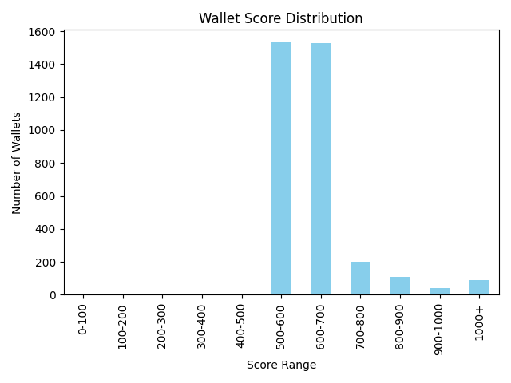

# Wallet Score Analysis

After scoring all wallets, this document provides an analysis of the results, including score distribution and behavioral insights.

## Score Distribution

Below is the distribution of wallet scores across defined ranges:

| Score Range | Number of Wallets |
|-------------|-------------------|
| 0-100       | 0                 |
| 100-200     | 0                 |
| 200-300     | 0                 |
| 300-400     | 0                 |
| 400-500     | 0                 |
| 500-600     | 1532              |
| 600-700     | 1528              |
| 700-800     | 201               |
| 800-900     | 106               |
| 900-1000    | 41                |
| 1000+       | 89                |

### Score Distribution Graph

*Graph: Distribution of wallet scores across ranges.*

## Behavioral Analysis

### Wallets in the Lower Range (500-600)
- These wallets make up the largest group. They likely represent users with minimal or average activity, possibly with fewer transactions, lower amounts, or less engagement with the protocol. Their behavior may be more passive or risk-averse, or they may be new or infrequent users.

### Wallets in the Middle Range (600-800)
- Wallets in this range show moderate activity, possibly engaging more frequently or with higher transaction volumes. They may participate in both lending and borrowing, and show more consistent or diversified protocol usage.

### Wallets in the Higher Range (800+)
- These wallets are relatively rare. They likely represent highly active users, large volume participants, or those with consistently positive behaviors (e.g., regular repayments, high collateralization, or low-risk actions). Some may be power users or institutional actors.

## Insights
- The vast majority of wallets are clustered in the 500-700 score range, indicating that most users have average or slightly above-average engagement.
- Very few wallets achieve extremely high scores (900+), suggesting that exceptional activity or behavior is rare.
- There are no wallets in the 0-500 range, which may indicate that the scoring model is calibrated such that even minimal activity results in a moderate score, or that the dataset is filtered to exclude very low-activity wallets.
- Further investigation could explore what specific behaviors or features drive wallets into the highest and lowest observed ranges. 